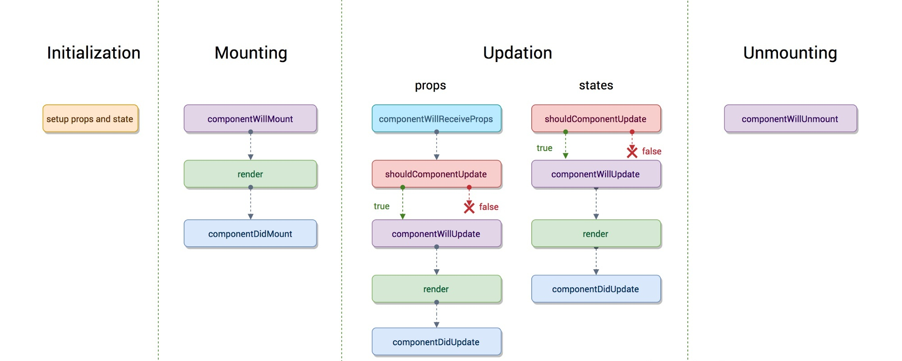
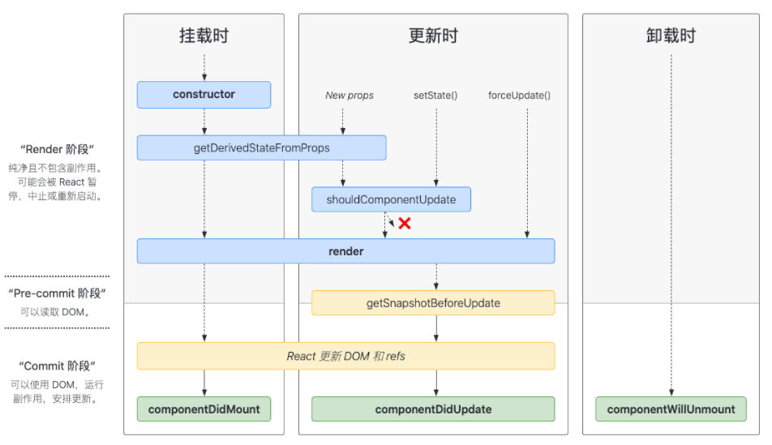
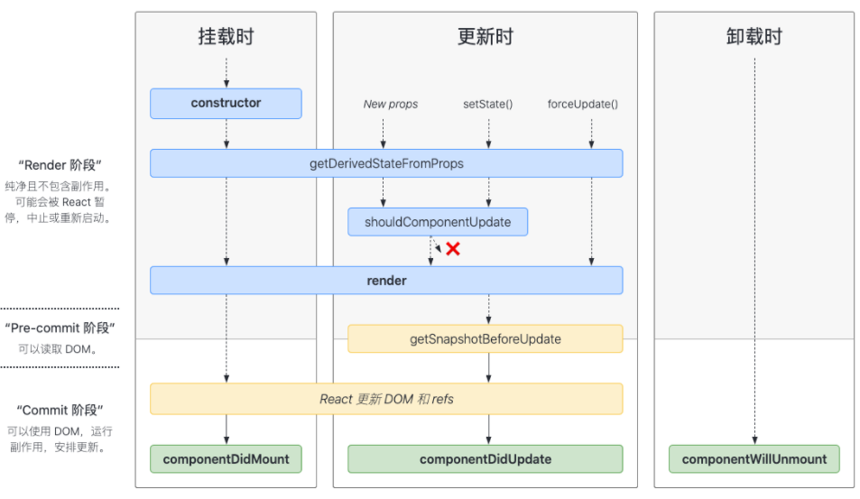

[TOC]

https://react.docschina.org

# 组件的生命周期

## react 16.3 之前



## React 16.3



## React 16.4 之后



## 生命周期方法介绍

### render()

class 组件中唯一必须要实现的方法，可以返回

- React 元素
- 数组或者 fragments
- Portals
- 字符串或数值类型
- 布尔值或者 null

### constructor()

**如果不初始化 state 或不进行方法绑定，则不需要为 React 组件实现构造函数。**

```js
constructor(props) {
  super(props);
  // 不要在这里调用 this.setState()
  this.state = { counter: 0 };
  this.handleClick = this.handleClick.bind(this);
}
```

**避免将 props 的值复制给 state！这是一个常见的错误**。**只有在你刻意忽略 prop 更新的情况下使用**，此时，应将 prop 重命名为 `initialProp` 或 `defaultProp`

设计组件时，重要的是确定组件是受控组件还是非受控组件，不要直接复制（mirror） props 的值到 state 中。

https://react.docschina.org/blog/2018/06/07/you-probably-dont-need-derived-state.html

### componentDidMount()

`componentDidMount()` 会在组件挂载后（插入 DOM 树中）立即调用

### componentDidUpdate(prevProps, prevState, snapshot)

`componentDidUpdate()` 会在更新后会被立即调用。首次渲染不会执行此方法。

可以再`componentDidUpdate()` 中**直接调用 `setState()`**，但请注意**它必须被包裹在一个条件语句里**，正如上述的例子那样进行处理，否则会导致死循环。

### componentWillUnmount()

`componentWillUnmount()` 会在组件卸载及销毁之前直接调用。在此方法中执行必要的清理操作，例如，清除 timer，取消网络请求或清除在 `componentDidMount()` 中创建的订阅等。

### shouldComponentUpdate(nextProps, nextState)

当 props 或 state 发生变化时，`shouldComponentUpdate()` 会在渲染执行之前被调用。返回值默认为 true。首次渲染或使用 `forceUpdate()` 时不会调用该方法。你应该**考虑使用内置的 [`PureComponent`](https://react.docschina.org/docs/react-api.html#reactpurecomponent) 组件**，而不是手动编写。

### static getDerivedStateFromProps(nextProps, nextState)

`getDerivedStateFromProps` 会在调用 render 方法之前调用，并且在初始挂载及后续更新时都会被调用。它应返回一个对象来更新 state，如果返回 null 则不更新任何内容。

派生状态会导致代码冗余，并使组件难以维

- 如果你需要**执行副作用**（例如，数据提取或动画）以响应 props 中的更改，请改用 [`componentDidUpdate`](https://react.docschina.org/docs/react-component.html#componentdidupdate)。
- 如果只想在 **prop 更改时重新计算某些数据**，[请使用 memoization helper 代替](https://react.docschina.org/blog/2018/06/07/you-probably-dont-need-derived-state.html#what-about-memoization)。
- 如果你想**在 prop 更改时“重置”某些 state**，请考虑使组件[完全受控](https://react.docschina.org/blog/2018/06/07/you-probably-dont-need-derived-state.html#recommendation-fully-controlled-component)或[使用 `key` 使组件完全不受控](https://react.docschina.org/blog/2018/06/07/you-probably-dont-need-derived-state.html#recommendation-fully-uncontrolled-component-with-a-key) 代替。

### getSnapshotBeforeUpdate(prevProps, prevState)

`getSnapshotBeforeUpdate()` 在最近一次渲染输出（提交到 DOM 节点）之前调用。它使得组件能在发生更改之前从 DOM 中捕获一些信息（例如，滚动位置）。此生命周期的任何返回值将作为参数传递给 `componentDidUpdate()`。

```js
class ScrollingList extends React.Component {
  constructor(props) {
    super(props);
    this.listRef = React.createRef();
  }

  getSnapshotBeforeUpdate(prevProps, prevState) {
    // 我们是否在 list 中添加新的 items ？
    // 捕获滚动​​位置以便我们稍后调整滚动位置。
    if (prevProps.list.length < this.props.list.length) {
      const list = this.listRef.current;
      return list.scrollHeight - list.scrollTop;
    }
    return null;
  }

  componentDidUpdate(prevProps, prevState, snapshot) {
    // 如果我们 snapshot 有值，说明我们刚刚添加了新的 items，
    // 调整滚动位置使得这些新 items 不会将旧的 items 推出视图。
    //（这里的 snapshot 是 getSnapshotBeforeUpdate 的返回值）
    if (snapshot !== null) {
      const list = this.listRef.current;
      list.scrollTop = list.scrollHeight - snapshot;
    }
  }

  render() {
    return <div ref={this.listRef}>{/* ...contents... */}</div>;
  }
}
```

### static getDerivedStateFromError(error)

此生命周期会在后代组件抛出错误后被调用。 它将抛出的错误作为参数，并返回一个值以更新 state

```js
class ErrorBoundary extends React.Component {
  constructor(props) {
    super(props);
    this.state = { hasError: false };
  }

  static getDerivedStateFromError(error) {
    // 更新 state 使下一次渲染可以显降级 UI
    return { hasError: true };
  }

  render() {
    if (this.state.hasError) {
      // 你可以渲染任何自定义的降级  UI
      return <h1>Something went wrong.</h1>;
    }

    return this.props.children;
  }
}
```

注意：`getDerivedStateFromError()` 会在`渲染`阶段调用，因此不允许出现副作用。 如遇此类情况，请改用 `componentDidCatch()`。

**数据获取，设置订阅以及手动更改 React 组件中的 DOM 都属于副作用**

### componentDidCatch(error, info)

此生命周期在后代组件抛出错误后被调用。 它接收两个参数：

1. `error` —— 抛出的错误。
2. `info` —— 带有 `componentStack` key 的对象，其中包含[有关组件引发错误的栈信息](https://react.docschina.org/docs/error-boundaries.html#component-stack-traces)。

```js
class ErrorBoundary extends React.Component {
  constructor(props) {
    super(props);
    this.state = { hasError: false };
  }

  static getDerivedStateFromError(error) {
    // 更新 state 使下一次渲染可以显示降级 UI
    return { hasError: true };
  }

  componentDidCatch(error, info) {
    // "组件堆栈" 例子:
    //   in ComponentThatThrows (created by App)
    //   in ErrorBoundary (created by App)
    //   in div (created by App)
    //   in App
    logComponentStackToMyService(info.componentStack);
  }

  render() {
    if (this.state.hasError) {
      // 你可以渲染任何自定义的降级 UI
      return <h1>Something went wrong.</h1>;
    }

    return this.props.children;
  }
}
```

注意：如果发生错误，你可以通过调用 `setState` 使用 `componentDidCatch()` 渲染降级 UI，但在未来的版本中将不推荐这样做。 可以使用静态 `getDerivedStateFromError()` 来处理降级渲染。

### UNSAFE_componentWillMount()

### UNSAFE_componentWillReceiveProps(nextProps)

只要父组件重新渲染就会执行，可以在这里比较组件属性，并设置状态

### UNSAFE_componentWillUpdate(nextProps, nextState)

注意，你不能此方法中调用 `this.setState()`；在 `UNSAFE_componentWillUpdate()` 返回之前，你也不应该执行任何其他操作（例如，dispatch Redux 的 action）触发对 React 组件的更新。

通常，此方法可以替换为 `componentDidUpdate()`。如果你在此方法中读取 DOM 信息（例如，为了保存滚动位置），则可以将此逻辑移至 `getSnapshotBeforeUpdate()` 中。

### setState()

```js
// setState(updater, [callback])
this.setState((state, props) => {
  return { counter: state.counter + props.step };
});
```

### forceUpdate(callback)

默认情况下，当组件的 state 或 props 发生变化时，组件将重新渲染。如果 `render()` 方法依赖于其他数据，则可以调用 `forceUpdate()` 强制让组件重新渲染。

### defaultProps

```js
class CustomButton extends React.Component {
  // ...
}

CustomButton.defaultProps = {
  color: 'blue'
};
```

### displayName

`displayName` 字符串多用于调试消息。通常，你不需要设置它，因为它可以根据函数组件或 class 组件的名称推断出来。如果调试时需要显示不同的名称或创建高阶组件.

```js
function withSubscription(WrappedComponent) {
  class WithSubscription extends React.Component {
    /* ... */
  }
  WithSubscription.displayName = `WithSubscription(${getDisplayName(WrappedComponent)})`;
  return WithSubscription;
}

function getDisplayName(WrappedComponent) {
  return WrappedComponent.displayName || WrappedComponent.name || 'Component';
}
```

# HOOKS

_Hook_ 是 React 16.8 的新增特性。它可以让你在不编写 class 的情况下使用 state 以及其他的 React 特性。

**不要在循环，条件或嵌套函数中调用 Hook，** 确保总是在你的 React 函数的最顶层调用他们。遵守这条规则，你就能确保 Hook 在每一次渲染中都按照同样的顺序被调用。这让 React 能够在多次的 `useState` 和 `useEffect` 调用之间保持 hook 状态的正确。

**不要在普通的 JavaScript 函数中调用 Hook。**在 React 的函数组件中调用 Hook，在自定义 Hook 中调用其他 Hook

**Hook 的调用顺序在每次渲染中都是相同的，所以它能够正常工作**

**目前暂时还没有对应不常用的 `getSnapshotBeforeUpdate`，`getDerivedStateFromError` 和 `componentDidCatch` 生命周期的 Hook 等价写法**

React Redux 从 v7.1.0 开始[支持 Hook API](https://react-redux.js.org/api/hooks) 并暴露了 `useDispatch` 和 `useSelector` 等 hook。

React Router 从 v5.1 开始[支持 hook](https://reacttraining.com/react-router/web/api/Hooks)。

## 自定义 Hook

通过自定义 Hook，可以将组件逻辑提取到可重用的函数中。

**自定义 Hook 是一个函数，其名称以 “`use`” 开头，函数内部可以调用其他的 Hook。**

## useState

```js
// 定义
const [state, setState] = useState(initialState);

const [state, setState] = useState(() => {
  const initialState = someExpensiveComputation(props);
  return initialState;
});

// 设置状态
setState((prevState) => {
  // 也可以使用 Object.assign
  return { ...prevState, ...updatedValues };
});
```

## useEffect

在函数组件主体内（这里指在 React 渲染阶段）改变 DOM、添加订阅、设置定时器、记录日志以及执行其他包含副作用的操作都是不被允许的，因为这可能会产生莫名其妙的 bug 并破坏 UI 的一致性。**如果需要执行副作用的操作，请使用 useEffect。**

```js
useEffect(() => {
  const subscription = props.source.subscribe();
  return () => {
    subscription.unsubscribe();
  };
}, [props.source]);
```

注意：如果你要使用了依赖，请确保数组中包含了**所有外部作用域中会发生变化且在 effect 中使用的变量**，否则你的代码会引用到先前渲染中的旧变量。

## useContext

接收一个 context 对象（`React.createContext` 的返回值）并返回该 context 的当前值。当前的 context 值由上层组件中距离当前组件最近的 `<MyContext.Provider>` 的 `value` prop 决定。

当组件上层最近的 `<MyContext.Provider>` 更新时，该 Hook 会触发重渲染，并使用最新传递给 `MyContext` provider 的 context `value` 值。即使祖先使用 [`React.memo`](https://react.docschina.org/docs/react-api.html#reactmemo) 或 [`shouldComponentUpdate`](https://react.docschina.org/docs/react-component.html#shouldcomponentupdate)，也会在组件本身使用 `useContext` 时重新渲染。

```js
const themes = {
  light: {
    foreground: '#000000',
    background: '#eeeeee'
  },
  dark: {
    foreground: '#ffffff',
    background: '#222222'
  }
};

const ThemeContext = React.createContext(themes.light);

function App() {
  return (
    <ThemeContext.Provider value={themes.dark}>
      <Toolbar />
    </ThemeContext.Provider>
  );
}

function Toolbar(props) {
  return (
    <div>
      <ThemedButton />
    </div>
  );
}

function ThemedButton() {
  const theme = useContext(ThemeContext);
  return (
    <button style={{ background: theme.background, color: theme.foreground }}>
      I am styled by theme context!
    </button>
  );
}
```

## useReducer

`useState` 的替代方案。`useReducer` 会比 `useState` 更适用，例如 state 逻辑较复杂且包含多个子值，或者下一个 state 依赖于之前的 state 等。并且，使用 `useReducer` 还能给那些会触发深更新的组件做性能优化，因为[你可以向子组件传递 `dispatch` 而不是回调函数](https://react.docschina.org/docs/hooks-faq.html#how-to-avoid-passing-callbacks-down) 。

### 通常用法

```js
const initialState = { count: 0 };

function reducer(state, action) {
  switch (action.type) {
    case 'increment':
      return { count: state.count + 1 };
    case 'decrement':
      return { count: state.count - 1 };
    default:
      throw new Error();
  }
}

function Counter() {
  const [state, dispatch] = useReducer(reducer, initialState);
  return (
    <>
      Count: {state.count}
      <button onClick={() => dispatch({ type: 'decrement' })}>-</button>
      <button onClick={() => dispatch({ type: 'increment' })}>+</button>
    </>
  );
}
```

### 惰性初始化

```js
function init(initialCount) {
  return { count: initialCount };
}

function reducer(state, action) {
  switch (action.type) {
    case 'increment':
      return { count: state.count + 1 };
    case 'decrement':
      return { count: state.count - 1 };
    case 'reset':
      return init(action.payload);
    default:
      throw new Error();
  }
}

function Counter({ initialCount }) {
  const [state, dispatch] = useReducer(reducer, initialCount, init);
  return (
    <>
      Count: {state.count}
      <button onClick={() => dispatch({ type: 'reset', payload: initialCount })}>Reset</button>
      <button onClick={() => dispatch({ type: 'decrement' })}>-</button>
      <button onClick={() => dispatch({ type: 'increment' })}>+</button>
    </>
  );
}
```

### 向子组件传递 dispatch

```js
const TodosDispatch = React.createContext(null);

function TodosApp() {
  // 提示：`dispatch` 不会在重新渲染之间变化
  const [todos, dispatch] = useReducer(todosReducer);

  return (
    <TodosDispatch.Provider value={dispatch}>
      <DeepTree todos={todos} />
    </TodosDispatch.Provider>
  );
}
```

## useCallback

`useCallback(fn, deps)` 相当于 `useMemo(() => fn, deps)`。

```js
const memoizedCallback = useCallback(() => {
  doSomething(a, b);
}, [a, b]);
```

## useMemo

传入 `useMemo` 的函数会在渲染期间执行。请不要在这个函数内部执行与渲染无关的操作，诸如副作用这类的操作属于 `useEffect` 的适用范畴，而不是 `useMemo`。

**你可以把 `useMemo` 作为性能优化的手段，但不要把它当成语义上的保证。**需要确保再没有 useMemo 的情况下也能正常渲染。

```js
const memoizedValue = useMemo(() => computeExpensiveValue(a, b), [a, b]);
```

## useRef

`useRef()` 比 `ref` 属性更有用。它可以[很方便地保存任何可变值](https://react.docschina.org/docs/hooks-faq.html#is-there-something-like-instance-variables)，**其类似于在 class 中使用实例字段的方式**。

```js
function TextInputWithFocusButton() {
  const inputEl = useRef(null);
  const onButtonClick = () => {
    // `current` 指向已挂载到 DOM 上的文本输入元素
    inputEl.current.focus();
  };
  return (
    <>
      <input ref={inputEl} type="text" />
      <button onClick={onButtonClick}>Focus the input</button>
    </>
  );
}
```

## useImperativeHandle

`useImperativeHandle` 可以让你在使用 `ref` 时自定义暴露给父组件的实例值。在大多数情况下，应当避免使用 ref 这样的命令式代码。`useImperativeHandle` 应当与 [`forwardRef`](https://react.docschina.org/docs/react-api.html#reactforwardref) 一起使用：

```js
function FancyInput(props, ref) {
  const inputRef = useRef();
  useImperativeHandle(ref, () => ({
    focus: () => {
      inputRef.current.focus();
    }
  }));
  return <input ref={inputRef} ... />;
}
FancyInput = forwardRef(FancyInput);
```

## useLayoutEffect

其函数签名与 `useEffect` 相同，但它会在所有的 DOM 变更之后同步调用 effect。可以使用它来读取 DOM 布局并同步触发重渲染。在浏览器执行绘制之前，`useLayoutEffect` 内部的更新计划将被同步刷新。

**如果你正在将代码从 class 组件迁移到使用 Hook 的函数组件，则需要注意 `useLayoutEffect` 与 `componentDidMount`、`componentDidUpdate` 的调用阶段是一样的。但是，我们推荐你一开始先用 `useEffect`，只有当它出问题的时候再尝试使用 `useLayoutEffect`。**

## useDebugValue

`useDebugValue` 可用于在 React 开发者工具中显示自定义 hook 的标签。

```js
useDebugValue(value);
```

# 常见问题

## 如何获取上一轮的 props 或 state？

目前，你可以 [通过 ref](https://react.docschina.org/docs/hooks-faq.html#is-there-something-like-instance-variables) 来手动实现：

```js
function Counter() {
  const [count, setCount] = useState(0);

  const prevCountRef = useRef();
  useEffect(() => {
    prevCountRef.current = count;
  });
  const prevCount = prevCountRef.current;

  return (
    <h1>
      Now: {count}, before: {prevCount}
    </h1>
  );
}
```

抽取为一个自定义 hook

```js
function usePrevious(value) {
  const ref = useRef();
  useEffect(() => {
    ref.current = value;
  });
  return ref.current;
}
```

## 为什么我会在我的函数中看到陈旧的 props 和 state？

```js
function Example() {
  const [count, setCount] = useState(0);

  function handleAlertClick() {
    setTimeout(() => {
      alert('You clicked on: ' + count);
    }, 3000);
  }

  return (
    <div>
      <p>You clicked {count} times</p>
      <button onClick={() => setCount(count + 1)}>Click me</button>
      <button onClick={handleAlertClick}>Show alert</button>
    </div>
  );
}
```

如果你先点击「Show alert」然后增加计数器的计数，那这个 alert 会显示**在你点击『Show alert』按钮时**的 `count` 变量。

最后，你看到陈旧的 props 和 state 的另一个可能的原因，是你使用了「依赖数组」优化但没有正确地指定所有的依赖。举个例子，如果一个 effect 指定了 `[]` 作为第二个参数，但在内部读取了 `someProp`，它会一直「看到」 `someProp` 的初始值。解决办法是要么移除依赖数组，要么修正它。

## 我该如何测量 DOM 节点？

获取 DOM 节点的位置或是大小的基本方式是使用 [callback ref](https://react.docschina.org/docs/refs-and-the-dom.html#callback-refs)。每当 ref 被附加到一个另一个节点，React 就会调用 callback。

```js
function MeasureExample() {
  const [height, setHeight] = useState(0);

  const measuredRef = useCallback((node) => {
    if (node !== null) {
      setHeight(node.getBoundingClientRect().height);
    }
  }, []);

  return (
    <>
      <h1 ref={measuredRef}>Hello, world</h1>
      <h2>The above header is {Math.round(height)}px tall</h2>
    </>
  );
}
```

抽取为一个 hook

```js
function useClientRect() {
  const [rect, setRect] = useState(null);
  const ref = useCallback((node) => {
    if (node !== null) {
      setRect(node.getBoundingClientRect());
    }
  }, []);
  return [rect, ref];
}
```

这同时也允许你通过 effect 内部的局部变量来处理无序的响应：

```js
useEffect(() => {
  let ignore = false;
  async function fetchProduct() {
    const response = await fetch('http://myapi/product/' + productId);
    const json = await response.json();
    if (!ignore) setProduct(json);
  }

  fetchProduct();
  return () => {
    ignore = true;
  };
}, [productId]);
```

## 错误依赖 bug

```
function Counter() {
  const [count, setCount] = useState(0);

  useEffect(() => {
    const id = setInterval(() => {
      setCount(count + 1); // 这个 effect 依赖于 `count` state
    }, 1000);
    return () => clearInterval(id);
  }, []); // 🔴 Bug: `count` 没有被指定为依赖

  return <h1>{count}</h1>;
}
```

传入空的依赖数组 `[]`，意味着该 hook 只在组件挂载时运行一次，并非重新渲染时。但如此会有问题，在 `setInterval` 的回调中，`count` 的值不会发生变化。因为当 effect 执行时，我们会创建一个闭包，并将 `count` 的值被保存在该闭包当中，且初值为 `0`。每隔一秒，回调就会执行 `setCount(0 + 1)`，因此，`count` 永远不会超过 1。

## 实现`shouldComponentUpdate`

```js
const Button = React.memo((props) => {
  // 你的组件
});
```

### 如何记忆计算结果？

```js
const memoizedValue = useMemo(() => computeExpensiveValue(a, b), [a, b]);
```

## 如何从 `useCallback` 读取一个经常变化的值？

我们推荐 [在 context 中向下传递 `dispatch`](https://react.docschina.org/docs/hooks-faq.html#how-to-avoid-passing-callbacks-down) 而非在 props 中使用独立的回调。下面的方法仅仅出于文档完整性考虑，以及作为一条出路在此提及。

```js
unction Form() {
  const [text, updateText] = useState('');
  const textRef = useRef();

  useEffect(() => {
    textRef.current = text; // 把它写入 ref
  });

  const handleSubmit = useCallback(() => {
    const currentText = textRef.current; // 从 ref 读取它
    alert(currentText);
  }, [textRef]); // 不要像 [text] 那样重新创建 handleSubmit

  return (
    <>
      <input value={text} onChange={e => updateText(e.target.value)} />
      <ExpensiveTree onSubmit={handleSubmit} />
    </>
  );
}
```

# ReactDOM

## render()

```
ReactDOM.render(element, container[, callback])
```

`ReactDOM.render()` 会控制你传入容器节点里的内容。当首次调用时，容器节点里的所有 DOM 元素都会被替换，后续的调用则会使用 React 的 DOM 差分算法（DOM diffing algorithm）进行高效的更新。

`ReactDOM.render()` 不会修改容器节点（只会修改容器的子节点）。可以在不覆盖现有子节点的情况下，将组件插入已有的 DOM 节点中。

## hydrate()

```
ReactDOM.hydrate(element, container[, callback])
```

与 [`render()`](https://react.docschina.org/docs/react-dom.html#render) 相同，但它用于在 [`ReactDOMServer`](https://react.docschina.org/docs/react-dom-server.html) 渲染的容器中对 HTML 的内容进行 hydrate 操作。React 会尝试在已有标记上绑定事件监听器。

## createPortal()

创建 portal。[Portal](https://react.docschina.org/docs/portals.html) 将提供一种将子节点渲染到 DOM 节点中的方式，该节点存在于 DOM 组件的层次结构之外。

```
ReactDOM.createPortal(child, container)
```

## unmountComponentAtNode()

```
ReactDOM.unmountComponentAtNode(container)
```

从 DOM 中卸载组件，会将其事件处理器（event handlers）和 state 一并清除。如果指定容器上没有对应已挂载的组件，这个函数什么也不会做。如果组件被移除将会返回 `true`，如果没有组件可被移除将会返回 `false`。

# ReactDOMServer

## renderToString()

将 React 元素渲染为初始 HTML。React 将返回一个 HTML 字符串。你可以使用此方法在服务端生成 HTML，并在首次请求时将标记下发，以加快页面加载速度，并允许搜索引擎爬取你的页面以达到 SEO 优化的目的。

```
ReactDOMServer.renderToString(element)
```

## renderToStaticMarkup()

此方法与 [`renderToString`](https://react.docschina.org/docs/react-dom-server.html#rendertostring) 相似，但此方法不会在 React 内部创建的额外 DOM 属性，例如 `data-reactroot`。如果你希望把 React 当作静态页面生成器来使用，此方法会非常有用，因为去除额外的属性可以节省一些字节。

如果你计划在前端使用 React 以使得标记可交互，请不要使用此方法。你可以在服务端上使用 [`renderToString`](https://react.docschina.org/docs/react-dom-server.html#rendertostring) 或在前端上使用 [`ReactDOM.hydrate()`](https://react.docschina.org/docs/react-dom.html#hydrate) 来代替此方法。

```js
ReactDOMServer.renderToStaticMarkup(element);
```

## renderToNodeStream()

将一个 React 元素渲染成其初始 HTML。返回一个可输出 HTML 字符串的[可读流](https://nodejs.org/api/stream.html#stream_readable_streams)。通过可读流输出的 HTML 完全等同于 [`ReactDOMServer.renderToString`](https://react.docschina.org/docs/react-dom-server.html#rendertostring) 返回的 HTML。你可以使用本方法在服务器上生成 HTML，并在初始请求时将标记下发，以加快页面加载速度，并允许搜索引擎抓取你的页面以达到 SEO 优化的目的。

```js
ReactDOMServer.renderToNodeStream(element);
```

## renderToStaticNodeStream()

此方法与 [`renderToNodeStream`](https://react.docschina.org/docs/react-dom-server.html#rendertonodestream) 相似，但此方法不会在 React 内部创建的额外 DOM 属性，例如 `data-reactroot`。如果你希望把 React 当作静态页面生成器来使用，此方法会非常有用，因为去除额外的属性可以节省一些字节。

# DOM 元素

## dangerouslySetInnerHTML

`dangerouslySetInnerHTML` 是 React 为浏览器 DOM 提供 `innerHTML` 的替换方案。通常来讲，使用代码直接设置 HTML 存在风险，因为很容易无意中使用户暴露于[跨站脚本（XSS）](https://en.wikipedia.org/wiki/Cross-site_scripting)的攻击。因此，你可以直接在 React 中设置 HTML，但当你想设置 `dangerouslySetInnerHTML` 时，需要向其传递包含 key 为 `__html` 的对象，以此来警示你。例如：

```js
function createMarkup() {
  return { __html: 'First &middot; Second' };
}

function MyComponent() {
  return <div dangerouslySetInnerHTML={createMarkup()} />;
}
```

## checked

当 `<input>` 组件的 type 类型为 `checkbox` 或 `radio` 时，组件支持 `checked` 属性。你可以使用它来设置组件是否被选中。这对于构建受控组件（controlled components）很有帮助。而 `defaultChecked` 则是非受控组件的属性，用于设置组件首次挂载时是否被选中。

## htmlFor

由于 `for` 在 JavaScript 中是保留字，所以 React 元素中使用了 `htmlFor` 来代替。

## onChange

`onChange` 事件与预期行为一致：每当表单字段变化时，该事件都会被触发。我们故意没有使用浏览器已有的默认行为，是因为 `onChange` 在浏览器中的行为和名称不对应，并且 React 依靠了该事件实时处理用户输入。

## selected

`<option>` 组件支持 `selected` 属性。你可以使用该属性设置组件是否被选择。这对构建受控组件很有帮助。

## value

`<input>` 和 `<textarea>` 组件支持 `value` 属性。你可以使用它为组件设置 value。这对于构建受控组件是非常有帮助。`defaultValue` 属性对应的是非受控组件的属性，用于设置组件第一次挂载时的 value。

## suppressContentEditableWarning

通常，当拥有子节点的元素被标记为 `contentEditable` 时，React 会发出一个警告，因为这不会生效。该属性将禁止此警告。尽量不要使用该属性，除非你要构建一个类似 [Draft.js](https://facebook.github.io/draft-js/) 的手动管理 `contentEditable` 属性的库。

## suppressHydrationWarning

如果你使用 React 服务端渲染，通常会在当服务端与客户端渲染不同的内容时发出警告。但是，在一些极少数的情况下，很难甚至于不可能保证内容的一致性。例如，在服务端和客户端上，时间戳通常是不同的。

# 合成事件

`SyntheticEvent` 实例将被传递给你的事件处理函数，它是浏览器的原生事件的跨浏览器包装器。除兼容所有浏览器外，它还拥有和浏览器原生事件相同的接口，包括 `stopPropagation()` 和 `preventDefault()`。

如果因为某些原因，当你需要使用浏览器的底层事件时，只需要使用 `nativeEvent` 属性来获取即可。每个 `SyntheticEvent` 对象都包含以下属性：

```js
boolean bubbles
boolean cancelable
DOMEventTarget currentTarget
boolean defaultPrevented
number eventPhase
boolean isTrusted
DOMEvent nativeEvent
void preventDefault()
boolean isDefaultPrevented()
void stopPropagation()
boolean isPropagationStopped()
void persist()
DOMEventTarget target
number timeStamp
string type
```

## 事件池

`SyntheticEvent` 是合并而来。这意味着 `SyntheticEvent` 对象可能会被重用，而且在事件回调函数被调用后，所有的属性都会无效。出于性能考虑，你不能通过异步访问事件。

```js
function onClick(event) {
  console.log(event); // => nullified object.
  console.log(event.type); // => "click"
  const eventType = event.type; // => "click"

  setTimeout(function () {
    console.log(event.type); // => null
    console.log(eventType); // => "click"
  }, 0);

  // 不起作用，this.state.clickEvent 的值将会只包含 null
  this.setState({ clickEvent: event });

  // 你仍然可以导出事件属性
  this.setState({ eventType: event.type });
}
```

如果你想异步访问事件属性，你需在事件上调用 `event.persist()`，此方法会从池中移除合成事件，允许用户代码保留对事件的引用。

## 支持的事件

React 通过将事件 normalize 以让他们在不同浏览器中拥有一致的属性。

以下的事件处理函数在冒泡阶段被触发。如需注册捕获阶段的事件处理函数，则应为事件名添加 `Capture`。例如，处理捕获阶段的点击事件请使用 `onClickCapture`，而不是 `onClick`。

### 剪贴板事件

事件名：

```
onCopy onCut onPaste
```

属性：

```
DOMDataTransfer clipboardData
```

---

### 复合事件

事件名:

```
onCompositionEnd onCompositionStart onCompositionUpdate
```

属性:

```
string data
```

---

### 键盘事件

事件名:

```
onKeyDown onKeyPress onKeyUp
```

属性:

```
boolean altKey
number charCode
boolean ctrlKey
boolean getModifierState(key)
string key
number keyCode
string locale
number location
boolean metaKey
boolean repeat
boolean shiftKey
number which
```

`key` 属性可以是 [DOM Level 3 Events spec](https://www.w3.org/TR/uievents-key/#named-key-attribute-values) 里记录的任意值。

---

### 焦点事件

事件名：

```
onFocus onBlur
```

这些焦点事件在 React DOM 上的所有元素都有效，不只是表单元素。

属性：

```
DOMEventTarget relatedTarget
```

---

### 表单事件

事件名：

```
onChange onInput onInvalid onReset onSubmit
```

想了解 onChange 事件的更多信息，查看 [Forms](https://react.docschina.org/docs/forms.html) 。

---

### 通用事件

事件名称：

```
onError onLoad
```

---

### Mouse Events

鼠标事件：

```
onClick onContextMenu onDoubleClick onDrag onDragEnd onDragEnter onDragExit
onDragLeave onDragOver onDragStart onDrop onMouseDown onMouseEnter onMouseLeave
onMouseMove onMouseOut onMouseOver onMouseUp
```

`onMouseEnter` 和 `onMouseLeave` 事件从离开的元素向进入的元素传播，不是正常的冒泡，也没有捕获阶段。

属性：

```
boolean altKey
number button
number buttons
number clientX
number clientY
boolean ctrlKey
boolean getModifierState(key)
boolean metaKey
number pageX
number pageY
DOMEventTarget relatedTarget
number screenX
number screenY
boolean shiftKey
```

---

### 指针事件

事件名:

```
onPointerDown onPointerMove onPointerUp onPointerCancel onGotPointerCapture
onLostPointerCapture onPointerEnter onPointerLeave onPointerOver onPointerOut
```

`onPointerEnter` 和 `onPointerLeave` 事件从离开的元素向进入的元素传播，不是正常的冒泡，也没有捕获阶段。

属性：

如 [W3 spec](https://www.w3.org/TR/pointerevents/) 中定义的，指针事件通过以下属性扩展了[鼠标事件](https://react.docschina.org/docs/events.html#mouse-events)：

```
number pointerId
number width
number height
number pressure
number tangentialPressure
number tiltX
number tiltY
number twist
string pointerType
boolean isPrimary
```

关于跨浏览器支持的说明：

并非每个浏览器都支持指针事件（在写这篇文章时，已支持的浏览器有：Chrome，Firefox，Edge 和 Internet Explorer）。React 故意不通过 polyfill 的方式适配其他浏览器，主要是符合标准的 polyfill 会显著增加 react-dom 的 bundle 大小。

如果你的应用要求指针事件，我们推荐添加第三方的指针事件 polyfil 。

---

### 选择事件

事件名：

```
onSelect
```

---

### 触摸事件

事件名：

```
onTouchCancel onTouchEnd onTouchMove onTouchStart
```

属性：

```
boolean altKey
DOMTouchList changedTouches
boolean ctrlKey
boolean getModifierState(key)
boolean metaKey
boolean shiftKey
DOMTouchList targetTouches
DOMTouchList touches
```

---

### UI 事件

事件名：

```
onScroll
```

属性：

```
number detail
DOMAbstractView view
```

---

### 滚轮事件

事件名：

```
onWheel
```

属性：

```
number deltaMode
number deltaX
number deltaY
number deltaZ
```

---

### 媒体事件

事件名：

```
onAbort onCanPlay onCanPlayThrough onDurationChange onEmptied onEncrypted
onEnded onError onLoadedData onLoadedMetadata onLoadStart onPause onPlay
onPlaying onProgress onRateChange onSeeked onSeeking onStalled onSuspend
onTimeUpdate onVolumeChange onWaiting
```

---

### 图像事件

事件名：

```
onLoad onError
```

---

### 动画事件

事件名：

```
onAnimationStart onAnimationEnd onAnimationIteration
```

属性：

```
string animationName
string pseudoElement
float elapsedTime
```

---

### 过渡事件

事件名：

```
onTransitionEnd
```

属性：

```
string propertyName
string pseudoElement
float elapsedTime
```

---

### 其他事件

事件名：

```
onToggle
```

# 实践案例

## 定时器 hook

### 版本 1

这个一个糟糕的例子

```js
export function useCountdown1() {
  const [count, setCount] = useState(60);

  useEffect(() => {
    if (count === 0) {
      return;
    }
    console.log('useCountdown1：创建定时器');
    const time = setInterval(() => {
      setCount(count - 1);
    }, 1000);
    return () => {
      console.log('useCountdown1：销毁定时器');
      clearInterval(time);
    };
  }, [count]);

  return count;
}
```

### 版本 2

我们稍微优化一下

```js
export function useCountdown2() {
  const [count, setCount] = useState(60);

  useEffect(() => {
    console.log('useCountdown2：创建定时器');
    const time = setInterval(() => {
      setCount((preCount) => {
        if (preCount === 0) {
          console.log('useCountdown2：销毁定时器');
          clearInterval(time);
          return 0;
        }
        return preCount - 1;
      });
    }, 1000);
    return () => {
      console.log('useCountdown2：销毁定时器');
      clearInterval(time);
    };
  }, []);

  return count;
}
```

### 版本 3

对外提供服务的计时器，我们抽取变量并将其改成毫秒数，使其可以控制的力度可以更细

```js
export function useCountdown3(initCount: number, interval = 1000) {
  const [count, setCount] = useState(initCount);

  useEffect(() => {
    console.log('useCountdown3：创建定时器');
    const time = setInterval(() => {
      setCount((preCount) => {
        if (preCount <= interval) {
          console.log('useCountdown3：销毁定时器');
          clearInterval(time);
          return 0;
        }
        return preCount - interval;
      });
    }, interval);
    return () => {
      console.log('useCountdown3：销毁定时器');
      clearInterval(time);
    };
  }, [interval]);

  return count;
}
```

### 版本 4

在倒计时过程中，我们可以重置计时器

```js
export function useCountdown4(initCount: number, interval = 1000) {
  const [count, setCount] = useState(initCount);

  useEffect(() => {
    console.log('useCountdown4：创建定时器');
    const time = setInterval(() => {
      setCount((preCount) => {
        if (preCount <= interval) {
          console.log('useCountdown4：销毁定时器');
          clearInterval(time);
          return 0;
        }
        return preCount - interval;
      });
    }, interval);
    return () => {
      console.log('useCountdown4：销毁定时器');
      clearInterval(time);
    };
  }, [interval]);

  const reset = () => {
    setCount(initCount);
  };

  return { count, reset };
}
```

### 版本 5

在倒计时结束之后，我们也可以重置计时器

```js
export function useCountdown5(initCount: number, interval = 1000) {
  const [count, setCount] = useState(initCount);
  // 一个增长的计时器，用于重置倒计时
  const [ignored, forceUpdate] = useReducer((x) => x + 1, 0);

  useEffect(() => {
    console.log('useCountdown5：创建定时器');
    const time = setInterval(() => {
      setCount((preCount) => {
        if (preCount <= interval) {
          console.log('useCountdown5：销毁定时器');
          clearInterval(time);
          return 0;
        }
        return preCount - interval;
      });
    }, interval);
    return () => {
      console.log('useCountdown5：销毁定时器');
      clearInterval(time);
    };
  }, [interval, ignored]);

  const reset = () => {
    setCount(initCount);
    forceUpdate();
  };

  return { count, reset };
}
```

### 版本 6

通过外部更改 initCount，可以重置计时器，主要为了支持通过服务端时间校准计时器

```js
export function useCountdown6(initCount: number, interval = 1000) {
  const [count, setCount] = useState(initCount);
  // 一个增长的计时器，用于重置倒计时
  const [ignored, forceUpdate] = useReducer((x) => x + 1, 0);

  const reset = useCallback(() => {
    setCount(initCount);
    forceUpdate();
  }, [initCount]);

  useEffect(() => {
    reset();
  }, [reset]);

  useEffect(() => {
    console.log('useCountdown6：创建定时器');
    const time = setInterval(() => {
      setCount((preCount) => {
        if (preCount <= interval) {
          console.log('useCountdown6：销毁定时器');
          clearInterval(time);
          return 0;
        }
        return preCount - interval;
      });
    }, interval);
    return () => {
      console.log('useCountdown6：销毁定时器');
      clearInterval(time);
    };
  }, [interval, ignored]);

  return { count, reset };
}
```

### 最后

我们再提供一个工具方法，用来支持内容显示需求

```js
export function remainHMS(time: number) {
  const remainDay = Math.floor(time / (24 * 60 * 60 * 1000));
  const remainTime = time % (24 * 60 * 60 * 1000);
  const remainHour = Math.floor(remainTime / (60 * 60000));
  const remainMinutes = Math.floor((remainTime % (60 * 60000)) / 60000);
  const remainSeconds = Math.floor((remainTime % 60000) / 1000);
  return {
    d: remainDay,
    h: remainHour,
    m: remainMinutes,
    s: remainSeconds
  };
}
```

## 分页 hook

## Tab 组件
