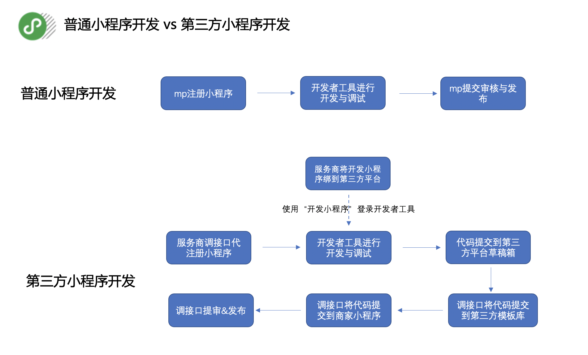
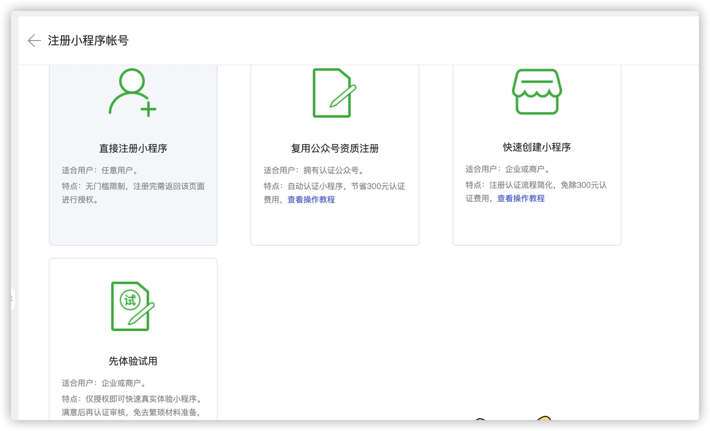

# 小程序自动化调查

https://open.weixin.qq.com/

注册开放平台---> 开通第三方平台---> 申请开发小程序 --->将小程序绑定为第三方平台的开发小程序

**登录开放平台，进入管理中心-第三方平台-详情-开发配置**

## 第三方平台（平台型和定制化型）

微信开放平台-第三方平台（简称第三方平台）开放给所有通过[开发者资质认证](https://kf.qq.com/faq/170824URbmau170824r2uY7j.html)的开发者使用。在得到公众号或小程序运营者（简称运营者）[授权](https://developers.weixin.qq.com/doc/oplatform/Third-party_Platforms/2.0/api/Before_Develop/Authorization_Process_Technical_Description.html)后，第三方平台开发者可以通过调用微信开放平台的接口能力，为公众号或小程序的运营者提供账号申请、小程序创建、技术开发、行业方案、活动营销、插件能力等全方位服务。

https://developers.weixin.qq.com/doc/oplatform/Third-party_Platforms/2.0/product/Third_party_platform_appid.html

在技术上，第三方平台是通过获得公众号或小程序的接口能力的授权，然后代公众平台帐号调用各业务接口来实现业务的，因此，第三方平台在调用各接口时，必须遵循公众平台运营规范，详见：[《微信公众平台运营规范》](https://mp.weixin.qq.com/cgi-bin/readtemplate?t=business/faq_operation_tmpl&type=info&lang=zh_CN&token=)

**若希望能通过商家扫码即可授权给服务商进行代开发代运营，则应当选择平台型第三方**

### 平台型第三方平台应用场景

1、为商家提供综合的解决方案，整体打包公众号或小程序的产品开发、运营等；

2、为小程序商家提供小程序代开发服务、代运营服务；

3、为小商店商家提供小商店增值服务；

4、为公众号商家例如提供专门优化图文消息视觉样式和排版的工具，或专门定制的 CRM 用户管理功能、精细化运营用户公众号等；

- 注，绑定开发小程序的操作，请查看[绑定开发小程序](https://developers.weixin.qq.com/doc/oplatform/Third-party_Platforms/2.0/operation/thirdparty/dev.html)
- 更多关于第三方平台代开发小程序介绍可查看https://developers.weixin.qq.com/miniprogram/dev/devtools/ext.html
- 上述流程是将代码提交到草稿箱，再到模板库再提交到小程序。如果想实现直接将代码提交到小程序，则可以通过使用 directCommit 直接提交至待审核列表。directCommit是ext.json里的一个参数，详情可查看[extAppid 的开发调试](https://developers.weixin.qq.com/miniprogram/dev/devtools/ext.html)
- 除了通过开发者工具提交代码，还可以通过[miniprogram-ci](https://developers.weixin.qq.com/miniprogram/dev/devtools/ci.html)提交代码，directCommit同样适用于ci工具；
- 使用第三方代开发模式，重点需要关注ext.json文件的使用，详情可查看https://developers.weixin.qq.com/miniprogram/dev/devtools/ext.html

开发模板： https://developers.weixin.qq.com/miniprogram/dev/devtools/ext.html

上传代码： https://developers.weixin.qq.com/doc/oplatform/Third-party_Platforms/2.0/api/code/commit.html

- 小程序授权托管之后，只能使用第三方平台的在微信开放平台登记的服务器域名和业务域名。所以第三方平台在帮助旗下小程序发布代码之前，需先把服务器域名和业务域名设置到小程序的服务器域名和业务域名中
- 设置接口详见[设置服务器域名](https://developers.weixin.qq.com/doc/oplatform/Third-party_Platforms/2.0/api/Mini_Program_Basic_Info/Server_Address_Configuration.html)和[设置业务域名](https://developers.weixin.qq.com/doc/oplatform/Third-party_Platforms/2.0/api/Mini_Program_Basic_Info/setwebviewdomain.html)。

- 第三方小程序审核规则、加急等操作指引请查看[第三方服务商提审限额机制优化说明](https://developers.weixin.qq.com/community/minihome/doc/00022ce7b209f09f363b9c62958401?blockType=99)

同一个微信用户的 OpenID 在不同的公众号/小程序下不一样的。如果开发者拥有多个移动应用、网站应用、和公众帐号（包括小程序），可通过 UnionID 来区分用户的唯一性，因为只要是同一个微信开放平台帐号下的移动应用、网站应用和公众帐号（包括小程序），用户的 UnionID 是唯一的。换句话说，同一用户，对同一个微信开放平台下的不同应用，UnionID 是相同的。

## 将自己的小程序授权第三方托管

## 小程序模板开发

### 标准模板库用途

标准模板库的用途有两个：

1、标准模板库的代码模板审核通过之后，以及符合一定条件下，将标准模板库代码提交到小程序后，不再需要经过人工代码审核，可自动过审、然后提交发布，提高发布效率；（模板审核功能正在开发中，即将上线，请及时关注官方相关公告）

2、标准模板库的代码模板，可授权托管给微信服务平台，然后即可在微信服务平台进行售卖，相关入驻流程可查看[小程序先试后付专区招募通知](https://developers.weixin.qq.com/community/develop/doc/0000a2aa338ce8b40a1c165fd53c01)

## 

## 自动化发布小程序

服务端调用发布接口

https://developers.weixin.qq.com/doc/oplatform/Third-party_Platforms/2.0/api/code/commit.html

别人家的小程序：

选择模板--> 定制页面-->注册小程序-->授权-->

## 可视化搭建小程序